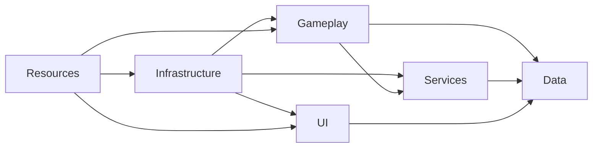
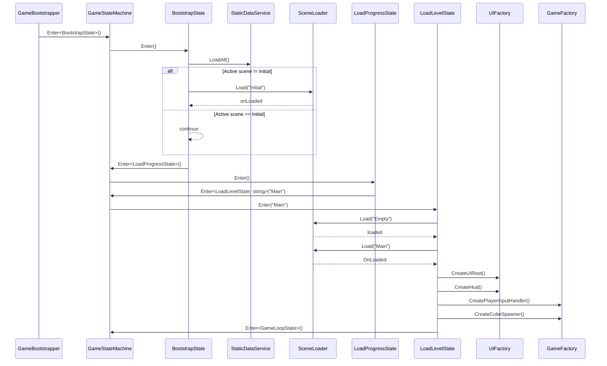
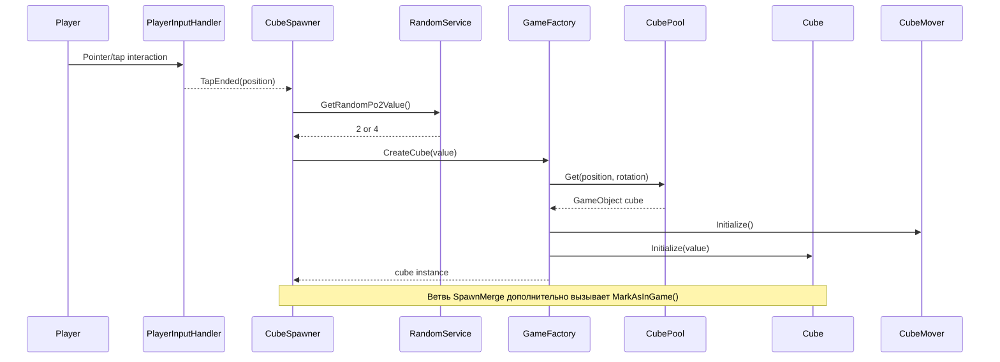
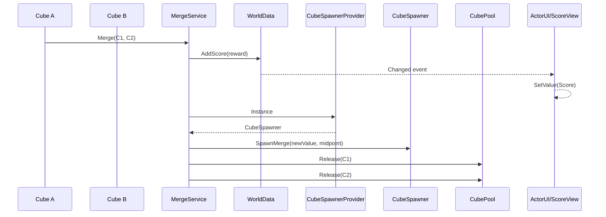
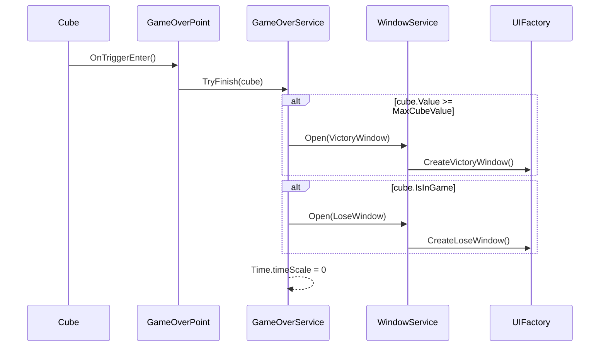

# ARCHITECTURE.md

## 1. Header и назначение

### Название проекта
- Проект: `2048` (physics-based вариация 2048 на Unity).
- Версия Unity: `6000.3.8f1` (`ProjectSettings/ProjectVersion.txt`).

### Цель документа
Документ фиксирует архитектурную модель проекта: runtime-потоки, модули, контракты, инварианты, точки расширения и правила эволюции архитектуры.

### Целевая аудитория
- Gameplay-разработчики.
- UI-разработчики.
- Infrastructure/architecture разработчики.
- AI-агенты, вносящие изменения в код и конфигурацию проекта.

### Границы документа
- Внутри scope: runtime-архитектура, state machine, DI, сцены, ресурсы, сервисы, data/event flow.
- Вне scope: арт-пайплайн, release-процессы, маркетинговые материалы, внешняя CI-инфраструктура.

### Правило путей
Во всём документе используются только `repo-relative` пути (от корня репозитория), без абсолютных путей.

---

## 2. System Context

### Продуктовый контекст
Проект реализует игровую механику в духе 2048 в физическом пространстве:
- игрок управляет положением спавна по оси;
- кубы запускаются в игровое поле;
- при столкновении равных значений происходит merge;
- начисляется score;
- по условиям победы/поражения показывается соответствующее окно.

### Технический стек
- Engine: Unity.
- Язык: C#.
- DI: Zenject.
- UI: UGUI + TextMeshPro.
- UI animation: DOTween.
- Asset loading: `Resources.Load` через `IStaticDataService` (ScriptableObject-конфиги в `Assets/Resources/StaticData`).

### Основные директории
- `Assets/Code/Infrastructure`
- `Assets/Code/Gameplay`
- `Assets/Code/Services`
- `Assets/Code/UI`
- `Assets/Code/Data`
- `Assets/Resources`
- `ProjectSettings`

---

## 3. Runtime Flow (end-to-end)

### 3.1 Boot flow
1. `GameBootstrapper.Start()` вызывает вход в `BootstrapState` через `GameStateMachine`.
2. `BootstrapState` вызывает `IStaticDataService.LoadAll()`.
3. `BootstrapState` проверяет текущую сцену:
- если уже `Initial`, продолжает flow;
- иначе загружает `Initial` через `SceneLoader`.
4. `BootstrapState` переводит состояние в `LoadProgressState`.
5. `LoadProgressState` вызывает переход в `LoadLevelState` с payload `"Main"`.
6. `LoadLevelState` выполняет загрузку `Empty`, затем `Main`.
7. После загрузки `Main` выполняется:
- `UIFactory.CreateUIRoot()`;
- `UIFactory.CreateHud()`;
- `GameFactory.CreatePlayerInputHandler()`;
- `GameFactory.CreateCubeSpawner()`.
8. Далее state machine входит в `GameLoopState`.

### 3.2 Игровой цикл
1. Игрок взаимодействует с input (`PlayerInputHandler`).
2. `CubeSpawner` подписан на `TapEnded` и запускает spawn нового куба.
3. `GameFactory` создаёт/получает куб через `CubePool`.
4. `CubeMover` управляет drag + launch.
5. При столкновении равных кубов `Cube` вызывает `IMergeService.Merge(...)`.
6. `MergeService`:
- рассчитывает новый value;
- увеличивает score через `IWorldData.AddScore(...)`;
- создаёт merged cube через `CubeSpawnerProvider.Instance.SpawnMerge(...)`;
- возвращает старые кубы в pool.
7. UI (`ActorUI`/`ScoreView`) обновляется по событию `WorldData.Changed`.

### 3.3 Завершение игры
1. `Cube` достигает `GameOverPoint`.
2. `GameOverPoint` делегирует в `IGameOverService.TryFinish(...)`.
3. `GameOverService` открывает окно через `IWindowService`.
4. Игра ставится на паузу: `Time.timeScale = 0`.

---

## 4. Модульная декомпозиция и ответственность

### Infrastructure (`Assets/Code/Infrastructure`)
Отвечает за оркестрацию приложения:
- state machine (`GameStateMachine`, состояния);
- загрузку сцен (`SceneLoader`);
- DI-композицию (`BootstrapInstaller`);
- фабрики уровня приложения (`GameFactory`, `StateFactory`, `UIFactory`).

### Gameplay (`Assets/Code/Gameplay`)
Отвечает за игровое поведение объектов:
- `Cube`, `CubeMover`, `CubeSpawnPoint`, `CubeRotationActivator`;
- `CubeSpawner`;
- `PlayerInputHandler`;
- `GameOverPoint`.

### Services (`Assets/Code/Services`)
Отвечают за доменные операции и инфраструктурные runtime-сервисы:
- merge (`MergeService`);
- game over (`GameOverService`);
- input abstraction (`StandaloneInputService`, `MobileInputService`);
- runtime providers (`CubeSpawnerProvider`, `CubeSpawnPointProvider`, `PlayerInputHandlerProvider`);
- pooling (`CubePool`);
- random (`RandomService`);
- static data provider (`StaticDataService`) для prefab/runtime-настроек.

### Data (`Assets/Code/Data`)
- `WorldData`: runtime state holder для score и событие `Changed`.

### UI (`Assets/Code/UI`)
- Отрисовка и обновление HUD/окон.
- Открытие окон через `IWindowService`.
- Создание UI через `IUIFactory`.
- Реакция на данные через `IWorldData`.

### Запреты на смешение ответственности
- UI не должен содержать merge/scoring-логику.
- Gameplay-объекты не создают окна напрямую, только через сервисный слой.
- Сервисы не должны напрямую изменять layout/визуальную структуру UI.
- Глобальные статики для runtime-состояния запрещены (использовать `IWorldData` и DI).

---

## 5. Dependency Injection Map (Zenject)

### 5.1 Источник правды
Все ключевые runtime-binds определяются в `Assets/Code/Infrastructure/Installers/BootstrapInstaller.cs`.

### 5.2 Карта биндингов
| Контракт/тип | Реализация | Lifetime | Назначение |
|---|---|---|---|
| `ICoroutineRunner` | `BootstrapInstaller` instance | `AsSingle` | Запуск корутин для `SceneLoader`. |
| `IGameFactory` | `GameFactory` | `AsSingle` | Создание player/spawner/cube. |
| `IStateFactory` | `StateFactory` | `AsSingle` | Resolve состояний state machine. |
| `IUIFactory` | `UIFactory` | `AsSingle` | Создание UI root, HUD, окон. |
| `GameStateMachine` | `GameStateMachine` | `AsSingle` | Управление состояниями игры. |
| `BootstrapState` | `BootstrapState` | `AsSingle` | Вход и стартовая загрузка. |
| `LoadLevelState` | `LoadLevelState` | `AsSingle` | Загрузка сцен и init game world. |
| `LoadProgressState` | `LoadProgressState` | `AsSingle` | Переход в загрузку `Main`. |
| `GameLoopState` | `GameLoopState` | `AsSingle` | Рабочий runtime-loop. |
| `IStaticDataService` | `StaticDataService` | `AsSingle` | Загрузка static data и prefab-конфигов из `Resources/StaticData`. |
| `IPlayerInputHandlerProvider` | `PlayerInputHandlerProvider` | `AsSingle` | Хранит ссылку на `PlayerInputHandler`. |
| `ICubeSpawnPointProvider` | `CubeSpawnPointProvider` | `AsSingle` | Хранит текущий `CubeSpawnPoint`. |
| `IMergeService` | `MergeService` | `AsSingle` | Логика merge и score reward. |
| `IRandomService` | `RandomService` | `AsSingle` | RNG для spawn/force. |
| `ICubeSpawnerProvider` | `CubeSpawnerProvider` | `AsSingle` | Хранит `CubeSpawner`. |
| `IGameOverService` | `GameOverService` | `AsSingle` | Lose/victory decision и завершение игры. |
| `IWorldData` | `WorldData` | `AsSingle` | Runtime score + event. |
| `IWindowService` | `WindowService` | `AsSingle` | Открытие UI окон по enum. |
| `ICubePool` | `CubePool` | `AsSingle` | Object pooling кубов. |
| `IInputService` | `StandaloneInputService`/`MobileInputService` | `AsSingle` | Платформенная абстракция input. |
| `SceneLoader` | `SceneLoader` | `AsSingle` | Асинхронная загрузка сцен. |

### 5.3 Platform split
- В Editor: `IInputService -> StandaloneInputService`.
- В non-Editor runtime: `IInputService -> MobileInputService`.

### 5.4 Паттерн безопасного добавления зависимостей
Для нового runtime-сервиса:
1. Добавить интерфейс `I*Service` в соответствующий модуль.
2. Добавить реализацию `*Service`.
3. Зарегистрировать bind в `BootstrapInstaller`.
4. Проверить, что все потребители получают зависимость через constructor/`[Inject]`.

Для нового state:
1. Добавить класс, реализующий `IState` или `IPayloadedState<T>`.
2. Зарегистрировать bind в `BindStates()`.
3. Добавить точку входа/перехода в существующий flow state machine.

---

## 6. Data & Event Model

### 6.1 Данные
`IWorldData` / `WorldData`:
- `Score` — текущий счёт.
- `Changed` — событие об изменении счёта.
- `AddScore(int)` — атомарное обновление score + событие.

### 6.2 Событийные контракты
- `PlayerInputHandler.TapStarted`.
- `PlayerInputHandler.TapEnded`.
- `WorldData.Changed`.
- `Cube.ValueUpdated`.

### 6.3 Lifecycle-паттерн подписки
- Подписка выполняется в `Initialize()`/`Construct()`/`Start()` (в зависимости от класса).
- Отписка обязательна в `Cleanup()` и/или `OnDestroy()`.
- Подписка без отписки считается дефектом.

### 6.4 Типовые ошибки
- Event leaks при повторном использовании объектов из pool.
- Дублированные подписки из-за повторной инициализации.
- Вызов событий на уничтоженные/деактивированные объекты.

---

## 7. Asset & Scene Contracts

### 7.1 Контракт ресурсов (StaticData)
Источники:
- `Assets/Resources/StaticData/Common/PrefabsStaticData.asset`
- `Assets/Resources/StaticData/Window/WindowStaticData.asset`

| `PrefabId` | Фактический asset |
|---|---|
| `Cube` | `Assets/Resources/Cube/Cube.prefab` |
| `CubeSpawner` | `Assets/Resources/Cube/CubeSpawner.prefab` |
| `PlayerInputHandler` | `Assets/Resources/Player/PlayerInputHandler.prefab` |
| `UIRoot` | `Assets/Resources/UI/UIRoot.prefab` |
| `Hud` | `Assets/Resources/UI/Hud.prefab` |

| `WindowType` | Фактический asset |
|---|---|
| `VictoryWindow` | `Assets/Resources/UI/VictoryWindow.prefab` |
| `LoseWindow` | `Assets/Resources/UI/LoseWindow.prefab` |

Дополнительные runtime-конфиги:
- `Assets/Resources/StaticData/Gameplay/CubeGameplayStaticData.asset`
- `Assets/Resources/StaticData/UI/ScoreViewStaticData.asset`

### 7.2 Контракт сцен
Сцены в build settings (`ProjectSettings/EditorBuildSettings.asset`):
- `Assets/Scenes/Initial.unity`
- `Assets/Scenes/Empty.unity`
- `Assets/Scenes/Main.unity`

Имена сцен, зашитые в state flow:
- `BootstrapState`: `Initial`.
- `LoadLevelState`: промежуточная `Empty`.
- `LoadProgressState`: payload `Main`.

### 7.3 Безопасная миграция при переименовании/перемещении
Если меняется путь/имя сцены или ресурса:
1. Обновить константы/строки в коде.
2. Обновить build settings.
3. Проверить загрузку сцен через `SceneLoader`.
4. Проверить резолв prefab через `IStaticDataService.GetPrefab`/`GetWindowPrefab`.
5. Прогнать runtime smoke-test.

---

## 8. Core Invariants

1. Все игровые кубы должны создаваться через `GameFactory` + `CubePool`.
2. Merge равных кубов обязан:
- создать ровно один merged cube;
- вернуть два исходных куба в pool;
- увеличить score.
3. Значение score в UI должно отражать `WorldData.Score`.
4. При финализации игры `Time.timeScale` должен стать `0`.
5. State transitions должны проходить детерминированно: `Initial -> Empty -> Main -> GameLoop`.
6. Сервисные singleton-объекты не должны дублироваться в runtime.

---

## 9. Расширение системы (playbook)

### 9.1 Добавление gameplay-сервиса
1. Создать интерфейс в `Assets/Code/Services/<Domain>/I*.cs`.
2. Создать реализацию в `Assets/Code/Services/<Domain>/*.cs`.
3. Добавить bind в `BootstrapInstaller.BindServices()`.
4. Внедрить зависимость в потребителей через DI.
5. Добавить пункт проверки в `Verification Checklist`.

### 9.2 Добавление нового окна UI
1. Создать prefab окна в `Assets/Resources/UI`.
2. Добавить запись в `Assets/Resources/StaticData/Window/WindowStaticData.asset`.
3. Добавить метод фабрики в `IUIFactory`/`UIFactory`.
4. Расширить `WindowType`.
5. Обновить `WindowService.Open(...)`.
6. Проверить открытие окна в runtime.

### 9.3 Добавление нового state
1. Реализовать `IState` или `IPayloadedState<T>` в `Assets/Code/Infrastructure/States`.
2. Зарегистрировать bind в `BindStates()`.
3. Добавить переходы в `GameStateMachine`-flow.
4. Проверить exit/enter semantics текущего активного состояния.

### 9.4 Добавление нового ресурса в `Resources`
1. Разместить prefab/asset в `Assets/Resources/...`.
2. Добавить/обновить запись:
   - в `Assets/Resources/StaticData/Common/PrefabsStaticData.asset` для gameplay/ui-root prefab;
   - в `Assets/Resources/StaticData/Window/WindowStaticData.asset` для окон.
3. Проверить отсутствие `null` при загрузке через `IStaticDataService`.

---

## 10. Known Risks / Tech Debt

### 10.1 Неполное покрытие новых данных в static data
- Файлы:
  - `Assets/Resources/StaticData/Common/PrefabsStaticData.asset`
  - `Assets/Resources/StaticData/Window/WindowStaticData.asset`
- Риск: новый prefab добавлен в `Assets/Resources`, но не добавлен в static-data конфиг.
- Влияние: `IStaticDataService` выбросит исключение при резолве.
- Рекомендация: валидировать конфиг при каждом изменении ресурсных prefab.

### 10.2 Потенциальный конфликт победы/поражения в `GameOverService`
- Файл: `Assets/Code/Services/GameOver/GameOverService.cs`.
- Риск: два последовательных `if` могут открыть `VictoryWindow`, затем `LoseWindow` в одном вызове `TryFinish(...)`.
- Влияние: неконсистентный UI финала.
- Рекомендация: перейти на взаимоисключающую логику (`if/else if`) с явным приоритетом финального состояния.

### 10.3 Уязвимость к `null` в `GameRunner`
- Файл: `Assets/Code/Infrastructure/GameRunner.cs`.
- Риск: инжектируемый `GameBootstrapper` при `null` передаётся в `Instantiate(bootstrapper)`.
- Влияние: возможный runtime exception в edge-сценариях.
- Рекомендация: заменить логику на явный prefab reference или гарантированный bootstrap entrypoint.

### 10.4 Рассинхронизация значений gameplay/UI и static data
- Файлы:
  - `Assets/Resources/StaticData/Gameplay/CubeGameplayStaticData.asset`
  - `Assets/Resources/StaticData/UI/ScoreViewStaticData.asset`
- Риск: параметры в конфиге отличаются от ожидаемых продуктовых значений.
- Влияние: непредсказуемое изменение баланса и ощущения от игры.
- Рекомендация: фиксировать baseline-значения и проверять их при ревью.

---

## 11. Verification Checklist

### 11.1 Компиляция и smoke
1. Проект открывается и компилируется в Unity без новых C# ошибок.
2. Сцены `Initial`, `Empty`, `Main` присутствуют в build settings.

### 11.2 Runtime сценарии
1. Spawn: куб появляется по пользовательскому input.
2. Merge: одинаковые значения корректно объединяются.
3. Score: счёт увеличивается и обновляет `ScoreView`.
4. Lose: открывается `LoseWindow`, игра на паузе.
5. Victory: открывается `VictoryWindow`, игра на паузе.

### 11.3 События и lifecycle
1. Нет double-subscribe на `TapStarted`/`TapEnded`/`Changed`.
2. При уничтожении/релизе объектов подписки снимаются.

### 11.4 Контракты загрузки
1. Все записи в `Common/PrefabsStaticData.asset` и `Window/WindowStaticData.asset` резолвятся в реальные prefab.
2. `SceneLoader` проходит ожидаемый boot chain без застреваний.

---

## 12. Change Management

### 12.1 Когда обновлять `ARCHITECTURE.md`
Обновление обязательно при:
- изменении state flow или boot chain;
- изменении DI-карты (`BootstrapInstaller`);
- изменении контрактов сцен/ресурсов;
- изменении модульных границ ответственности;
- добавлении/удалении ключевых сервисов/фабрик.

### 12.2 Синхронизация с `AGENTS.md`
- `AGENTS.md`: operational policy (как работать и что нельзя ломать).
- `ARCHITECTURE.md`: техническое устройство системы (как всё работает).
- При архитектурном изменении обновляются оба документа, если затронуты и правила, и устройство.

### 12.3 Правило завершённости
Изменение, затрагивающее архитектуру, считается незавершённым без обновлённой документации.

---

## Mermaid-диаграммы

### A. Component Diagram

### B. Sequence Diagram: Boot flow

### C. Sequence Diagram: Input to Spawn

### D. Sequence Diagram: Merge to Score/UI

### E. Sequence Diagram: Game over

### F. Graph Diagram: DI bindings

```mermaid
flowchart TD
    BI["BootstrapInstaller"] --> CR["ICoroutineRunner -> BootstrapInstaller"]
    BI --> F1["IGameFactory -> GameFactory"]
    BI --> F2["IStateFactory -> StateFactory"]
    BI --> F3["IUIFactory -> UIFactory"]

    BI --> S0["GameStateMachine"]
    BI --> S1["BootstrapState"]
    BI --> S2["LoadLevelState"]
    BI --> S3["LoadProgressState"]
    BI --> S4["GameLoopState"]

    BI --> SV1["IStaticDataService -> StaticDataService"]
    BI --> SV2["IPlayerInputHandlerProvider -> PlayerInputHandlerProvider"]
    BI --> SV3["ICubeSpawnPointProvider -> CubeSpawnPointProvider"]
    BI --> SV4["IMergeService -> MergeService"]
    BI --> SV5["IRandomService -> RandomService"]
    BI --> SV6["ICubeSpawnerProvider -> CubeSpawnerProvider"]
    BI --> SV7["IGameOverService -> GameOverService"]
    BI --> SV8["IWorldData -> WorldData"]
    BI --> SV9["IWindowService -> WindowService"]
    BI --> SV10["ICubePool -> CubePool"]

    BI --> INP["IInputService -> StandaloneInputService | MobileInputService"]
    BI --> SL["SceneLoader"]
```

---

## Приложение: Быстрый навигатор по ключевым файлам
- `Assets/Code/Infrastructure/Installers/BootstrapInstaller.cs`
- `Assets/Code/Infrastructure/States/BootstrapState.cs`
- `Assets/Code/Infrastructure/States/LoadProgressState.cs`
- `Assets/Code/Infrastructure/States/LoadLevelState.cs`
- `Assets/Code/Infrastructure/Factory/Game/GameFactory.cs`
- `Assets/Code/Gameplay/Cubes/Spawner/CubeSpawner.cs`
- `Assets/Code/Gameplay/Cubes/Cube.cs`
- `Assets/Code/Services/Merge/MergeService.cs`
- `Assets/Code/Services/GameOver/GameOverService.cs`
- `Assets/Code/Data/WorldData.cs`
- `Assets/Code/UI/Services/Windows/WindowService.cs`
- `Assets/Resources/StaticData/Common/PrefabsStaticData.asset`
- `Assets/Resources/StaticData/Window/WindowStaticData.asset`
- `ProjectSettings/EditorBuildSettings.asset`
